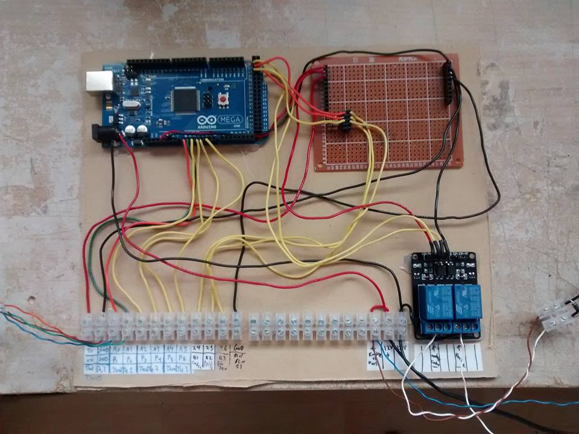

## Lost in Sea - Escape Room

In this folder are the different things I made for their room "Lost in Sea", where I worked on all of the electronics and software. 
The python script contains a portion of the game is used to send and receive commands to the Arduino. The monitor, which displays information to the players, is powered when needed by the Arduino. Then, the players have to input the right password and username to move on.
It is in fact a room in two episodes. I will be working with them this summer to make the next episode.

The code for the Arduino is available [here](./perdu.ino).
And here is the [code of the game](./perdu_en_mer_ep1.py).

### Picture
Here is the first version of the board. We added a lot more since then!

