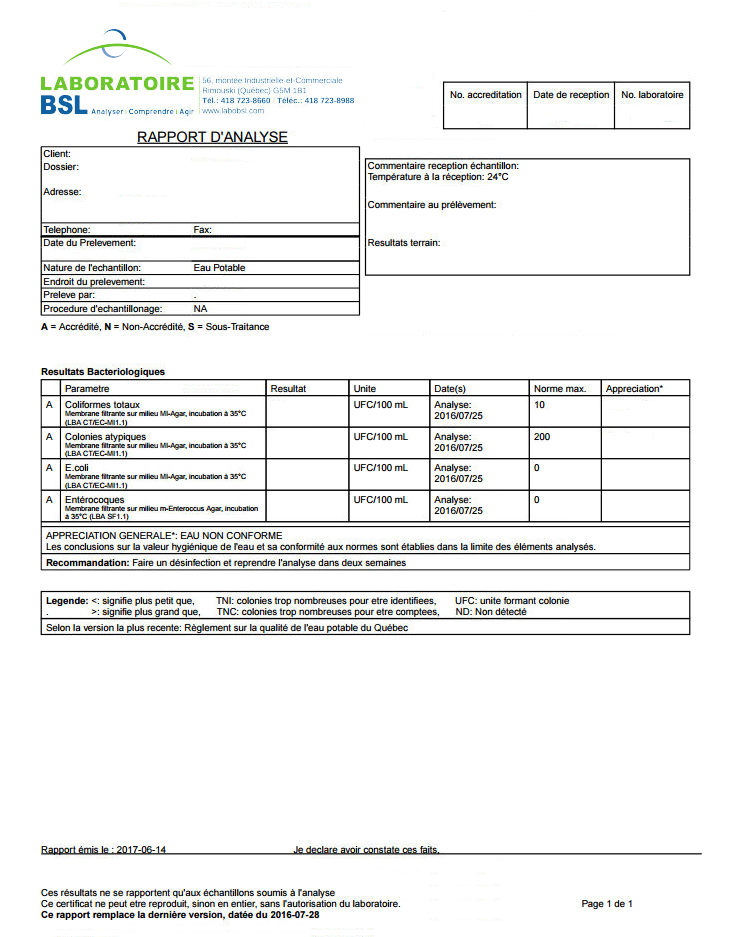
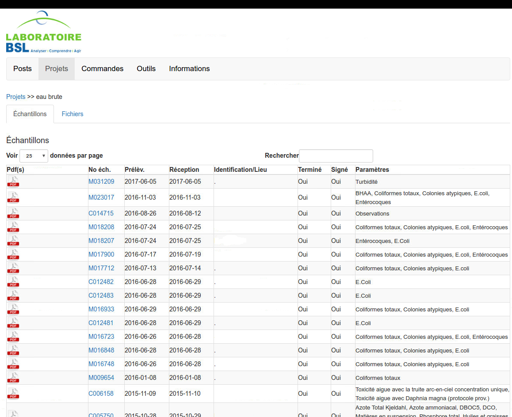

## Laboratory Information Management System (LIMS).
This is something I did for my job, a project that has been running since December 2012.
While working as a Microbiologist in a laboratory (which I didn't really enjoy), happenstance made it possible for me to start working on a new Laboratory Information Management System (LIMS). Knowing how to program and seeing the cost for a commercial LIMS license, the direction allowed me to start developing their new software.
It is a HUGE project made with Ruby on Rails. Through a web interface, the employees can enter received samples, generate PDF of results and deliver them automatically, manage inventory and about everything else related to the laboratory.
The direction being pleased with the software, I’ve then been asked to make a second software which the clients could use to access their results, make orders of sampling material and other useful tools.
I can’t share the code for this software since it belongs to the laboratory, but I've included some screenshot of it. For information, the git repository now counts over 138k lines of code.
Working on this software made me much better at coding, gave me more than basics about SQL databases and made me familiar with HTML, JavaScript, Ruby, Ruby On Rails, database design and a lot more.

### Screenshots
LIMS

Generated PDF

Client software

